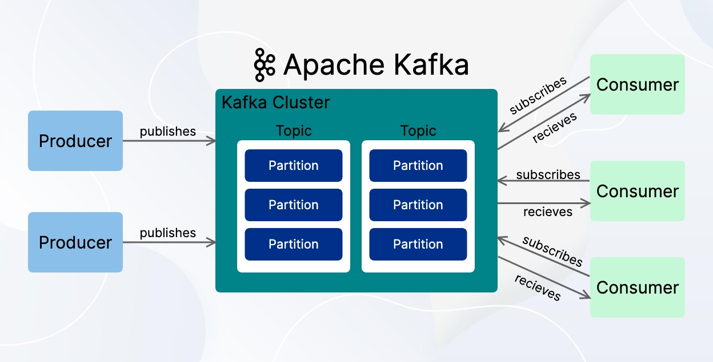

# Apache Kafka Setup and Usage Guide

A comprehensive, beginner-friendly guide to setting up and using **Apache Kafka** on Windows with **KRaft mode** (without ZooKeeper). This guide covers installation, configuration, usage, key Kafka concepts, terminology, and practical scenarios to help you master Kafka.

## Table of Contents
- [What is Apache Kafka?](#what-is-apache-kafka)
- [Key Kafka Terminology](#key-kafka-terminology)
- [Initial Setup](#initial-setup)
- [Topic Management](#topic-management)
- [Producer and Consumer Usage](#producer-and-consumer-usage)
- [Consumer Groups](#consumer-groups)
- [Practical Scenarios](#practical-scenarios)
  - [Scenario 1: One Producer with Multiple Consumers (Same Group)](#scenario-1-one-producer-and-two-consumers-in-same-group)
  - [Scenario 2: One Producer with Multiple Consumer Groups](#scenario-2-one-producer-and-two-consumer-groups)
- [Kafka UI](#kafka-ui)
- [Common Issues and Troubleshooting](#common-issues-and-troubleshooting)
- [Additional Resources](#additional-resources)

---

## What is Apache Kafka?

Apache Kafka is an **open-source distributed event streaming platform** designed for high-throughput, fault-tolerant, and scalable data processing. Originally developed by LinkedIn and later open-sourced under the Apache Software Foundation, Kafka is widely used for:

- **Real-time data pipelines**: Moving data between systems or applications.
- **Event sourcing**: Capturing and storing events as they happen.
- **Log aggregation**: Collecting logs from multiple sources.
- **Stream processing**: Analyzing data in real-time.

Kafka operates as a **publish-subscribe messaging system**, where **producers** send messages (events) to **topics**, and **consumers** subscribe to those topics to process the messages. Unlike traditional message queues, Kafka retains messages for a configurable period, allowing consumers to replay or process historical data.


---

---


---

## Key Kafka Terminology

Understanding Kafka’s core concepts is crucial for effectively using it. Below is a detailed explanation of the most important terms, including those directly relevant to this setup and additional ones for a fuller picture.

1. **Broker**  
   - **Definition**: A Kafka broker is a single server in a Kafka cluster responsible for storing, managing, and serving data (messages).  
   - **Details**: Each broker has a unique ID and can store multiple topic partitions. In a multi-broker cluster, data is distributed and replicated across brokers for fault tolerance. In this single-broker Windows setup (KRaft mode), one broker does all the work.  
   - **Example**: When you run `kafka-server-start.bat`, you start a broker listening on `localhost:9092`.  
   - **Why It Matters**: Brokers are the backbone of Kafka’s scalability and reliability.

2. **Topic**  
   - **Definition**: A topic is a logical category or stream name where messages are published, like a labeled folder or channel.  
   - **Details**: Topics categorize messages and can have multiple partitions for parallelism. They are durable, retaining messages for a configurable time (e.g., 7 days by default). Topics are created with a name, partition count, and replication factor.  
   - **Example**: `test-topic` or `orders` in this guide.  
   - **Why It Matters**: Topics allow producers and consumers to communicate about specific data types.

3. **Partition**  
   - **Definition**: A partition is a subset of a topic’s data, represented as an ordered, immutable log of messages.  
   - **Details**: Partitions enable scalability by splitting a topic’s data. Each partition is a sequence of messages with offsets (0, 1, 2, …). In this setup, you use `--partitions 1` for simplicity, meaning all messages go to one partition.  
   - **Example**: If `test-topic` has 3 partitions, messages are split across them based on keys or round-robin (if no key).  
   - **Why It Matters**: More partitions increase throughput; keys ensure consistent message routing.

4. **Producer**  
   - **Definition**: A producer is an application or process that sends messages to a Kafka topic.  
   - **Details**: Producers write data to topics, optionally using keys to determine partitions. They batch messages for efficiency. In this guide, the console producer (`kafka-console-producer.bat`) lets you type messages manually.  
   - **Example**: Sending `key1:value1` to `orders`.  
   - **Why It Matters**: Producers drive the flow of events into Kafka.

5. **Consumer**  
   - **Definition**: A consumer is an application or process that reads messages from a Kafka topic.  
   - **Details**: Consumers track their position with offsets and can read from the beginning (`--from-beginning`) or only new messages. The console consumer (`kafka-console-consumer.bat`) displays messages here.  
   - **Example**: Reading `Hello Kafka` from `test-topic`.  
   - **Why It Matters**: Consumers process data for real-time or historical use.

6. **Consumer Group**  
   - **Definition**: A set of consumers that work together to process messages from a topic, sharing partitions.  
   - **Details**: Each partition is assigned to one consumer in the group, ensuring no duplicates within the group. Kafka rebalances if consumers change. In your scenarios, `og` is a group with two consumers.  
   - **Example**: Two consumers in `og` reading `orders`.  
   - **Why It Matters**: Enables scalable, fault-tolerant consumption.

7. **Offset**  
   - **Definition**: A unique, sequential identifier for each message in a partition, tracking a consumer’s position.  
   - **Details**: Offsets start at 0 and increase (e.g., 0, 1, 2). Consumers commit offsets to resume after restarts. `--from-beginning` starts at offset 0.  
   - **Example**: Message `value1` at offset 5 in partition 0 of `orders`.  
   - **Why It Matters**: Ensures accurate message tracking.

8. **Replication Factor**  
   - **Definition**: The number of partition copies across brokers for fault tolerance.  
   - **Details**: A factor of 1 means no redundancy; 3 means three copies. Your setup uses `--replication-factor 1` (single broker). Replicas include a leader and followers.  
   - **Example**: With `replication-factor 3`, a failed broker leaves two copies.  
   - **Why It Matters**: Ensures data durability.

9. **KRaft Mode**  
   - **Definition**: Kafka Raft protocol, a ZooKeeper-free consensus mechanism introduced in Kafka 2.8+.  
   - **Details**: Brokers manage metadata internally using Raft. This guide uses KRaft, requiring a cluster ID and formatted storage.  
   - **Example**: Formatting with `kafka-storage.bat` sets up KRaft.  
   - **Why It Matters**: Simplifies deployment, ideal for single-node setups.

10. **Cluster ID**  
    - **Definition**: A unique identifier for a Kafka cluster in KRaft mode.  
    - **Details**: Generated as a UUID (e.g., `keuRGfK5RPmjohSucR1Cfg`) and used during storage formatting.  
    - **Example**: Generated via `kafka-storage.bat random-uuid`.  
    - **Why It Matters**: Ties broker data to the cluster.

11. **Leader and Follower (Replicas)**  
    - **Definition**: The leader replica handles reads/writes; followers sync for redundancy.  
    - **Details**: Only the leader processes requests. In your setup (`replication-factor 1`), there’s only a leader.  
    - **Example**: In a 3-broker cluster, partition 0’s leader is on Broker 1, followers on 2 and 3.  
    - **Why It Matters**: Ensures high availability.

12. **Message**  
    - **Definition**: The basic data unit in Kafka, with a key, value, timestamp, and optional headers.  
    - **Details**: Keys determine partitions; values are payloads. Your producer uses `key:value` format.  
    - **Example**: `order123:widget`.  
    - **Why It Matters**: Messages are the data flowing through Kafka.

13. **Bootstrap Server**  
    - **Definition**: The initial broker address clients connect to for cluster discovery.  
    - **Details**: In your setup, `localhost:9092`. In clusters, it’s a list (e.g., `broker1:9092,broker2:9092`).  
    - **Example**: Used in all your commands.  
    - **Why It Matters**: Entry point for Kafka communication.

14. **Log**  
    - **Definition**: The append-only message sequence in a partition, stored on disk.  
    - **Details**: Retained for a configurable time/size. Logs are in `C:\Kafka\logs` here.  
    - **Example**: Partition 0’s log: `[Msg1, Msg2, Msg3]`.  
    - **Why It Matters**: Enables durability and replayability.

15. **Retention Period**  
    - **Definition**: The duration/size limit for retaining messages in a topic.  
    - **Details**: Configurable in `server.properties` (e.g., `log.retention.hours=168`). Uses defaults here.  
    - **Example**: Messages older than 7 days are deleted.  
    - **Why It Matters**: Balances storage and data availability.

16. **Controller**  
    - **Definition**: The broker managing cluster metadata and tasks like leader elections.  
    - **Details**: In KRaft, it uses Raft and listens on `localhost:9093` (your setup).  
    - **Example**: Defined in `advertised.listeners`.  
    - **Why It Matters**: Coordinates the cluster without ZooKeeper.

---

## Initial Setup

Set up Kafka on Windows with KRaft mode.

### Prerequisites
- Java 8+ installed (Kafka runs on JVM).
- Kafka downloaded and extracted (e.g., to `C:\Kafka`).

### Step 1: Generate a Random UUID
Generate a cluster ID:
```powershell
PS C:\Kafka\bin\windows> .\kafka-storage.bat random-uuid

## Initial Setup

### Step 1: Generate a Random UUID
Generate a cluster ID:
```powershell
PS C:\Kafka\bin\windows> .\kafka-storage.bat random-uuid
```

### Step 2: Format the Storage Directory
Format the storage directory with the generated cluster ID:
```powershell
PS C:\Kafka> .\bin\windows\kafka-storage.bat format -t keuRGfK5RPmjohSucR1Cfg -c .\config\kraft\server.properties
```

### Step 3: Start Kafka Server
Launch the Kafka server:
```powershell
PS C:\Kafka> .\bin\windows\kafka-server-start.bat .\config\kraft\server.properties
```

## Topic Management

### Create a Topic
```powershell
PS C:\Kafka> .\bin\windows\kafka-topics.bat --create --topic test-topic --bootstrap-server localhost:9092 --partitions 1 --replication-factor 1
```

### List All Topics
```powershell
PS C:\Kafka\bin\windows> .\kafka-topics.bat --list --bootstrap-server localhost:9092
```

## Producer and Consumer Usage

### Basic Producer
Start a console producer to send messages:
```powershell
PS C:\Kafka> .\bin\windows\kafka-console-producer.bat --bootstrap-server localhost:9092 --topic test-topic
```

### Basic Consumer
Start a console consumer to receive messages:
```powershell
PS C:\Kafka> .\bin\windows\kafka-console-consumer.bat --bootstrap-server localhost:9092 --topic test-topic --from-beginning
```

## Consumer Groups

### View All Consumer Groups
```powershell
PS C:\Kafka> .\bin\windows\kafka-consumer-groups.bat --bootstrap-server localhost:9092 --list
```

### Describe a Consumer Group
Get detailed information about a specific consumer group:
```powershell
PS C:\Kafka> .\bin\windows\kafka-consumer-groups.bat --bootstrap-server localhost:9092 --group og --describe
```

## Practical Scenarios

### Scenario 1: One Producer and Two Consumers in Same Group

#### Start Producer with Key
```powershell
PS C:\Kafka> .\bin\windows\kafka-console-producer.bat --bootstrap-server localhost:9092 --topic orders --property parse.key=true --property key.separator=:
```

When the producer starts, you can enter messages in this format:
```
key1:value1
key2:value2
```

#### Start Two Consumers in Same Group
```powershell
# Consumer 1
PS C:\Kafka> .\bin\windows\kafka-console-consumer.bat --bootstrap-server localhost:9092 --topic orders --from-beginning --group og

# Consumer 2
PS C:\Kafka> .\bin\windows\kafka-console-consumer.bat --bootstrap-server localhost:9092 --topic orders --from-beginning --group og
```

**Note:** When using keys, messages are distributed based on the hash of the key, not necessarily in a round-robin manner. All messages with the same key will always go to the same partition. This doesn't guarantee even distribution among consumers in the same group.

### Scenario 2: One Producer and Two Consumer Groups

#### Start Producer with Key
```powershell
PS C:\Kafka> .\bin\windows\kafka-console-producer.bat --bootstrap-server localhost:9092 --topic orders --property parse.key=true --property key.separator=:
```

#### Start Two Consumers in Different Groups
```powershell
# Consumer in Group 1
PS C:\Kafka> .\bin\windows\kafka-console-consumer.bat --bootstrap-server localhost:9092 --topic orders --from-beginning --group og1

# Consumer in Group 2
PS C:\Kafka> .\bin\windows\kafka-console-consumer.bat --bootstrap-server localhost:9092 --topic orders --from-beginning --group og2
```

**Note:** Different consumer groups maintain their own offset positions independently. Each consumer group will receive all messages, but if multiple consumers exist within a single group, messages will be distributed among them based on partition assignment.

## Kafka UI

To set up a web UI for Kafka management:

### Step 1: Update Kafka Configuration
Change the `advertised.listeners` in `server.properties` from:
```
advertised.listeners=PLAINTEXT://localhost:9092,CONTROLLER://localhost:9093
```
To your machine's IP address:
```
advertised.listeners=PLAINTEXT://172.28.112.1:9092,CONTROLLER://localhost:9093
```

### Step 2: Run Kafka UI in Docker
```powershell
docker run --rm -d -p 8080:8080 \
  -e KAFKA_CLUSTERS_0_NAME=my-cluster \
  -e KAFKA_CLUSTERS_0_BOOTSTRAPSERVERS=172.28.112.1:9092 \
  --name kafkaui \
  provectuslabs/kafka-ui
```

Access the UI at http://localhost:8080

## Common Issues and Troubleshooting

If you encounter issues, check the following:

1. Ensure Kafka server is running
2. Verify port 9092 is not being used by another application
3. Check Kafka logs in `C:\Kafka\logs`
4. Make sure your firewall allows connections to Kafka ports

## Additional Resources

- [Apache Kafka Documentation](https://kafka.apache.org/documentation/)
- [Kafka CLI Tools Reference](https://kafka.apache.org/documentation/#cli)
